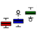
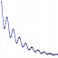

*****

**Under Construction**

*****

## R Topics

*****

## Packages

R is such a graphics rich language.  Why is the current "standard" R documentation only text instead of showing colorful, graphics visualizations?  This is a huge non-sequitur.

These pages are my R notes, often the R examples from the online help, showing the full graphics output.  

The next step is to add some reasonable explanations to the help examples that are often opaque and hard to understand.

|                                                                     | Package                                         | Description     | Source       |
|---------------------------------------------------------------------|-------------------------------------------------|-----------------|--------------|
|                         | [Boruta](package/Boruta/index.html)             |Feature Selection| [CRAN](http://cran.r-project.org/web/packages/Boruta/) |
|                        | [EBImage](package/EBImage/index.html)           |Image Processing | [Bioconductor](http://www.bioconductor.org/packages/release/bioc/html/EBImage.html) |
|                       | [gplots](package/gplots/index.html)             |Misc. Graphics   | [CRAN](http://cran.r-project.org/web/packages/gplots/) |
|             | [minpack.lm](package/minpack.lm/index.html)     |Non-Linear Curve Fit|[CRAN](http://cran.r-project.org/web/packages/minpack.lm/) |
|                            | [pca3d](package/pca3d/index.html)               |Show PCA analysis in 3D | [CRAN](http://cran.r-project.org/web/packages/pca3d/) |
|       | [RColorBrewer](package/RColorBrewer/index.html) |Color Palettes   | [CRAN](http://cran.r-project.org/web/packages/RColorBrewer/) |
| | [waveslim](package/waveslim/index.html)         |Wavelets         | [CRAN](http://cran.r-project.org/web/packages/waveslim/)     |

*****
 
## R Resources

*****

*efg*  
@EarlGlynn  
`r format(Sys.time(), "%Y-%m-%d  %H%M")`                  