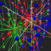

*****

**Under Construction**

*****

## R Topics

*****

## Packages

|                                                                     | Package                                         | Description     | Source       |
|---------------------------------------------------------------------|-------------------------------------------------|-----------------|--------------|
|                        | [EBImage](package/EBImage/index.html)           |Image Processing | [Bioconductor](http://www.bioconductor.org/) |
|                            | [pca3d](package/pca3d/index.html)               |Show PCA analysis in 3D | [CRAN](http://cran.r-project.org/web/packages/) |
|       | [RColorBrewer](package/RColorBrewer/index.html) |Color Palettes   | [CRAN](http://cran.r-project.org/web/packages/)         |
| | [waveslim](package/waveslim/index.html)         |Wavelets         | [CRAN](http://cran.r-project.org/web/packages/)         |

*****
 
## R Resources

*****

*efg*  
@EarlGlynn  
`r format(Sys.time(), "%Y-%m-%d  %H%M")`                  