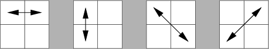
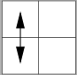

**[RNotes](../../index.html) | [EBImage](index.html)** 

*****

The discussion below outlines the steps needed to compute Haralick texture features in an image.  The first step is to compute a gray-level co-occurrence matrix.  The Haralick features are computed from various statistical properties of the co-occurence matrix.

Comments are included to help interpret the Haralick texture features as computed by the Bioconductor R package *EBImage* [Pau 2010].

## Grayscale Image

Let's consider a square N-by-N image matrix, $G(i,j)$, where each matrix element, a pixel value, is an integer over the range, $0, 1, ... N_g-1$. Usually $N_g$ is a power of 2. 

In a grayscale image the value 0 is usually displayed as black and the value $N_g-1$ is usually displayed as white.  Values in-between are shades of gray.  

Often the pixel values are treated as ranging from 0.0 to 1.0 by dividing all integers by $N_g - 1$.

## Gray-Level Co-occurrence Matrix (GLCM)

*"This matrix is square with dimension $N_g$, where $N_g$ is the number of gray levels in the image. Element [i,j] of the matrix is generated by counting the number of times a pixel with value i is adjacent to a pixel with value j and then dividing the entire matrix by the total number of such comparisons made. Each entry is therefore considered to be the probability that a pixel with value i will be found adjacent to a pixel of value j."*  [MurphyLab] 

$P_{ij} = P(i,j)$ = matrix of relative frequencies with which two neighboring resolution cells separated by distance $d$ occur on the image,  
  $p(i,j) = P(i,j)/R$ = (i,j)th entry in a normalized gray-tone spatial dependence matrix,    
  $N_g$ = number of distinct gray levels in the quantized image (the *EBImage* *haralick.nbins* parameter in the function *computerFeatures.haralick* defaults to 32 gray levels),  
  $R$ = normalizing constant = number of neighboring resolution cell pairs used in computing a particular gray-tone spatial-dependence matrix.
  
*"GLCM contains the second-order statistical information of spatial relationship of pixels of an image. From GLCM, Haralick  proposed 13 common statistical features, known as Haralick texture features."* [Pham 2010]
  
## Adjacency

*"Since adjacency can be defined to occur in each of four directions in a 2D, square pixel image (horizontal, vertical, left and right diagonals ...), four such matrices can be calculated."* [MurphyLab].



Graphic adapted from [MurphyLab] web site.

*"Four directions of adjacency as defined for calculation of the Haralick texture features. The Haralick statistics are calculated for co-occurrence matrices generated using each of these directions of adjacency."* [MurphyLab]

While looking at adjacency over 4 directions is common, it's possible to consider 8 separate directions.


### Example

The example in the next three sections was taken from [Pham 2010, p. 29] with distance $d = 1$ and the vertical direction ($\theta = 90$ and $\theta = 270$ degrees), which corresponds to the up and down arrows.



#### Grayscale image, G

Consider a 4-by-4 grayscale image $G$. 

Assume the grayscale pixel values range from 0 to 3 decimal (the four possible values with 2 bits). In this case, $N_g$ coincidentally is also 4.

The grayscale image can be shown as a matrix of numbers:

```{r, echo=FALSE,comment=""}
G <- matrix( c(0,0,0,2, 0,0,2,2, 1,1,2,3, 1,1,2,3), nrow=4, ncol=4)
rownames(G) <- paste0("[", 0:3, ",]")
colnames(G) <- paste0("[", 0:3, ",]")
G
```

Or, the image can be displayed as shades of gray:

```{r, echo=FALSE, fig.width=2.5, fig.height=2.5}
par(mar=c(0,0,0,0))
Gt <- t(G)
Gtflip <- Gt[,ncol(Gt):1]
image(Gtflip, axes=FALSE, ylab="", col=gray(0:3 / 3))
box()
abline(v=c(0.165, 0.50, 0.84), col="red" ,lty="dotted")  # line locations don't make sense
abline(h=c(0.165, 0.50, 0.84), col="red" ,lty="dotted")
```

In this case, matrix values of 0 correspond to black and values of 3 correspond to white.

#### Co-occurrence frequency matrix, P(i,j)

```{r, echo=FALSE,comment=""}
CoOccurrenceCounts <- matrix( c(6,0,2,0, 0,4,2,0, 2,2,2,2, 0,0,2,0), nrow=4, ncol=4)
rownames(CoOccurrenceCounts) <- paste0("[", 0:3, ",]")
colnames(CoOccurrenceCounts) <- paste0("[", 0:3, ",]")
CoOccurrenceCounts
```

The count of 6 in element [0,0] was found by looking for a 0 followed by another 0 (given $d = 1$) in each column, first counting from top-to-bottom, and then counting from bottom-to-top. 

Counting down in column 0 in the image matrix two pixels at a time, we see a "0 0" and a second "0 0" pair.  In column 1, we see only a single "0 0" pair.  The same three pairs are found counting up, so the total is 6.

The count of 0 in element [1,0] is because there are no "1 0" pairs counting down or counting up in all the columns.

The count of 2 in element [2,0] is because there is one "2 0" pair found counting up in column 0 and another counting up in column 1. There are no "2 0" pairs while counting in the down direction.

The sum of all elements of the frequency matrix is the normalizing value $R$:

$R = \sum_{i=1}^{N_g} \sum_{j=1}^{N_g} P(i,j) = `r sum(CoOccurrenceCounts)`$

#### Normalized Co-occurrence matrix, p(i,j)

The frequency matrix is normalized to probabilities by dividing each cell by $R$:

$p(i,j) = \frac {P(i,j)}{R}$

```{r, echo=FALSE,comment=""}
options(digits=3)
CoOccurrenceCounts/sum(CoOccurrenceCounts)
```

Obviously, $\sum_i \sum_j p(i,j) = `r sum(CoOccurrenceCounts/sum(CoOccurrenceCounts))`$

## Statistical Properties of Co-occurrence Matrix

[Miyamoto 2008] describes computation of a number of statistical properties of the co-occurrence matrix first, followed by computation of the Haralick texture features.

$R = \sum_{i=1}^{N_g} \sum_{j=1}^{N_g} P(i,j)$ = sum of all elements of co-occurrence frequency matrix

$p(i,j) = \frac {P(i,j)}{R}$ = co-occurence probability matrix

$p_x(i) = \sum_{j=1}^{N_g} p(i,j)$ = i-th entry in the marginal-probability matrix obtained by summing the rows of $p(i,j)$.

$p_y(j) = \sum_{i=1}^{N_g} p(i,j)$ = j-th entry in the marginal-probability matrix obtained by summing the columns of $p(i,j)$. 

$p_{x+y}(k) = \sum_{i=1}^{N_g}\sum_{j=1}^{N_g} \delta_{i+j, k} p(i,j), \qquad k = 2,3,..., 2N_g$

$p_{x-y}(k) = \sum_{i=1}^{N_g}\sum_{j=1}^{N_g} \delta_{|i-j|, k} p(i,j), \qquad k = 0,1,..., N_g-1$

<!---
Kronecker delta formatting from
http://www.cps.brockport.edu/~little/HANDOUTS/CS.pdf
-->
  
where the Kronecker delta function $\delta_{m,n}$ is defined by

$\delta_{m,n} =
  \left\{
    \begin{array}{11}
      1 & {\rm when ~} m=n\\
      0 & {\rm when ~} m\ne n
    \end{array}
  \right.
$

The Kronecker delta function was not used by Haralick or Miyamoto but should be equivalent to the specified summation conditions. 

$HX = -\sum_i p_x(i) \log(p_x(i))$ = entropy of $p_x$

$HY = -\sum_j p_y(j) \log(p_y(j))$ = entropy of $p_y$

$HXY = -\sum_i\sum_j p(i,j) \log(p(i,j))$

$HXY1 = -\sum_i\sum_j p(i,j) \log(p_x(i)p_y(j))$

$HXY2 = -\sum_i\sum_j p_x(i)p_y(j) \log(p_x(i)p_y(j))$


## Equations for Haralick Textural Features

Haralick named the texture features $f_1$ through $f_{14}$.  These names are preserved below.  (Some literature sources, e.g., [Pham 2010], do not maintain the same $f$ numbers.)

The R Bioconductor package *EBImage* computes 13 Haralick features, which it labels:  h.asm, h.con, h.cor, h.var, h.idm, h.sav, h.sva, h.sen, h.ent, h.dva, h.den, h.f12, h.f13.

For clarity the *EBImage* feature names are attached below. Some variations in the formulas and comments from other sources about the features are also included. 

The primary sources for these equations are [Haralick 1973] and [Miyamoto 2008].  Exercise caution when comparing formulas from various sources because of differences in the use of 0-based and 1-based indexing.

### 1. Angular Second Moment [asm]

The angular second-moment feature, *asm* or $f_1$, is a measure of homogeneity of the image.

$$f_1 = \sum_{i=1}^{N_g}\sum_{j=1}^{N_g} \Big(\frac{P(i,j)}{R}\Big)^2 = \sum_i\sum_jp(i,j)^2$$
  
In a homogeneous image there are very few dominant gray-tone transitions. *"Angular Second Moment is high when image has very good homogeneity or when pixels are very similar."* [Kumar 2014] 

### 2. Contrast [con]

The contrast feature, *con* or $f_2$, is a difference moment of the P matrix and is a measure of the contrast or the amount of local variations present in the image.

$$f_2 = \sum_{k=0}^{N_g-1} k^2 \bigg\{\sum_{i=1}^{N_g}\sum_{j=1}^{N_g} \delta_{|i-j|,k} p(i,j)\bigg\} = \sum_{k=0}^{N_g-1} k^2 p_{x-y}(k)$$


### 3. Correlation [cor]

*"Correlation measures the linear dependency of gray levels of neighboring pixels."* [Kumar 2014]

$$f_3 = \frac{\Large{\sum_{i=1}^{N_g}\sum_{j=1}^{N_g}} (ij)p(i,j) - \mu_x\mu_y}{\sigma_x\sigma_y}$$ 

where

$\mu_x$,  $\mu_y$, $\sigma_x$, $\sigma_y$ are the means and standard deviations of $p_x$ and $p_y$ 


### 4. Sum of Squares: Variance [var]

$$f_4 = \sum_{i=1}^{N_g}\sum_{j=1}^{N_g} (i - \mu)^2 p(i,j)$$

### 5. Inverse Difference Moment [idm]

*"Inverse Difference Moment (IDM) is the local homogeneity. It is high when local gray level is uniform and inverse GLCM is high."* [Kumar 2014]

$$f_5 = \sum_{i=1}^{N_g}\sum_{j=1}^{N_g} \frac{1}{1 + (i - j)^2} p(i,j)$$

### 6. Sum Average [sav]

$$f_6 = \sum_{i=2}^{2N_g} i p_{x+y}(i)$$

### 7. Sum Variance [sva]

$$f_7 = \sum_{i=2}^{2N_g} (i - f_8)^2 p_{x+y}(i)$$

### 8. Sum Entropy [sen]

Note:  Since some of the probabilites may be zero, and log(0) is not defined, it is recommended that the term log(p + $\epsilon$) be used in place of log(p) in entropy computations, where $\epsilon$ is an arbitrarily small positive constant.

$$f_8 = -\sum_{i=2}^{2N_g} p_{x+y}(i) \log(p_{x+y}(i))$$

*EBImage* uses a value of 1E-7 for $\epsilon$ and computes base-2 logarithms.

### 9. Entropy [ent]

$$f_9 = -\sum_{i=1}^{N_g}\sum_{j=1}^{N_g} p(i,j) \log(p(i,j))$$

Formulas from [Miyamoto 2008] clarify that $f_9 = HXY$ in Haralick's orginal paper. 

### 10. Difference Variance [dva]

$$f_{10} = {\rm variance \ of ~} p_{x-y}$$

See details in [Pham 2010, p. 28].

### 11. Difference Entropy [den]

$$f_{11} = -\sum_{i=0}^{N_g-1} p_{x-y}(i) \log(p_{x-y}(i))$$

### 12-13. Information Measures of Correlation [f12 and f13]

$$f_{12} = \frac{f_9 - HXY1}{\max(HX,HY)}$$

$$f_{13} = [1 - \exp(-2(HXY2 - f_9))]^{1/2}$$

### 14. Maximal Correlation Coefficient

*Note:  R Bioconductor package EBImage does not compute this value.*

$$f_{14} = ({\rm second \ largest \ eigenvalue \ of ~} Q)^{1/2}$$

where

$$Q(i,j) = \sum_k \frac{p(i,k)p(j,k)}{p_x(i)p_y(k)}$$

Haralick said *"these measures of correlation have some desirable properties which are not brought out in the rectangular correlation measure $f_3$."*

But [MurphyLab] says *"the maximal correlation coefficient was not calculated due to computational instability"*.  Murphy did not describe the nature of the instability.


## Haralick's 28 Features (and why use only 26)

Haralick's paper describes applying the 14 equations above to four angular gray-Level co-occurrence spatial dependency matrices, which results in four values from each equation above.

Haralick computed the mean and range for each of the 14 sets of four values resulting in 28 features.

Haralick suggests using these 28 textural features as a starting point to select a subset or linear combinatino of the 28 features.  

Haralick comments that some of the 28 features are strongly correlated with each other.

*"Since rotation invariance is a primary criterion for any features used with these images, a kind of invariance was achieved for each of these statistics by averaging them over the four directional co-occurrence matrices. The maximal correlation coefficient was not calculated due to computational instability so there were 13 texture features for each image. "* [MurphyLab]

[Loewke 2013] conducted analysis using the range and mean of the 13 meaures, averaged over the four directions, totaling 26 measures.  *"A subset of these was then given to the classifer."*

[Pham 10] shows computations of many of the quantities with a sample 4-by-4 image and 4-by-4 GLCM.


## EBImage Explorations

How sensitive are results to different *haralick.nbins* values?  (Default is 32.)  [Pha 10] looks at execution time for various values, but with a separate C++ program than used by *EBImage*.

What is the parameter *haralick.scale* for?  What does it do?

Where are the "Details" mentioned in the online help?

## References

**[Haralick]** Web site:  [Robert M Haralick](http://www.haralick.org/), City University of New York, Distinguished Professor. [Texture Journal Articles](http://www.haralick.org/journals/texture.shtml).  Accessed 2015-01-10.

**[Haralick 1973]** Robert M. Haralick, et al. [Textural Features for Image Classification](http://www.haralick.org/journals/TexturalFeatures.pdf). *IEEE Transactions on Systems, Man and Cybernetics*.  Vol. SMC-3, No. 6, Nov. 1973, pp. 610-621.  Accessed 2015-01-09.

**[Kumar 2014]** Rekhil M Kumar and Sreekumar K. [A Survey of Image Feature Descriptors](http://www.ijcsit.com/docs/Volume%205/vol5issue06/ijcsit20140506168.pdf). *International Journal of Computer Science and Information Technologies*, Vol. 5(6), 2014.  Accessed 2015-01-10.

**[Loewke 2013]** Nathan Loewke.  [Haralick Texture Analysis for Stem Cell Identification](https://stacks.stanford.edu/file/druid:np318ty6250/Loewke_Stem_Cell_Identification.pdf). Stanford Photonics Research Center.  [Class Project](https://stacks.stanford.edu/file/druid:ys177gb6618/Loewke_Stem_Cell_Identification.pdf). [Poster](https://stacks.stanford.edu/file/druid:fw095wd5869/Loewke_Stem_Cell_Identification.pdf).  2013.  Accessed 2015-01-10.

**[Miyamoto 2008]** Eizan Miyamoto and Thomas Merryman Jr.  [Fast Calculation of Haralick Texture Features](http://www.inf.ethz.ch/personal/markusp/teaching/18-799B-CMU-spring05/material/eizan-tad.pdf). Technical Report, Carnegie Mellon University.  Accessed 2015-01-10.

**[MurphyLab]** Web site:  [Haralick texture features](http://murphylab.web.cmu.edu/publications/boland/boland_node26.html).  Accessed 2015-01-10.

**[Pau 2010]**  G Pau, et al.  [EBImage -- an R package for image processing with appication to celluar phenotypes](http://bioinformatics.oxfordjournals.org/content/26/7/979).  *Bioinformatics*, 26(7), pp. 979-981.  2010.  Accessed 2015-01-10.

**[Pham 2010]** Tuan Anh Pham.  [Optimization of Texture Feature Extraction Algorithm](http://repository.tudelft.nl/view/ir/uuid%3Aa7924113-c9f8-435d-824f-0232ff6b419c/).  [Delft University of Technology](http://www.tudelft.nl/en/) Computer Engineering MSc Thesis.  2010.  Accessed 2015-01-10.

*****

*efg*  
`r format(Sys.time(), "%Y-%m-%d  %H%M")`            


