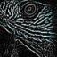

**[RNotes](../../index.html)**  

*****

## Topics

|                                  | Topic                                     |
|----------------------------------|-------------------------------------------|
|       | [Intro to EBImage](Intro-to-EBImage.html) |

*****

## Expanded Help Pages

|                                                          | Help                                     | Comments  |
|----------------------------------------------------------|------------------------------------------|-----------|
|   | [Binary Segmentation](Binary-Segmentation.html)  |   |
|                         | [Color](Color.html)                              |   |
|         | [Combining Images](Combining-Images.html)        |   |
|                   | [Draw Circle](Draw-Circle.html)                  |   |
|                                                          | [Features](Features.html)                        |   |
|                                                          | - [Basic Features](Features-Basic.html)            |   |
|                          | - [Haralick Features](Features-Haralick.html)      | [Technical Details](Haralick-Textural-Features.html)   |
|                   | - [Moment Features](Features-Moment.html)          |   |
|             | - [Shape Features](Features-Shape.html)            |   |
|                           | [Filters](Filters.html)           |   |
|                                                          | [Filling Holes and Regions](Filling.html)           |   |
|                                                          | [Histogram Equalization](Histogram-Equalization.html)           |   |
|                   | [Image Class](Image-Class.html)           |   |
|                   | [Image Stack](Image-Stack.html)           |   |
|                                                          | [Image Display and I/O](Image-Display-IO.html)           |   |
|                                                          | [Intensity values linear scaling](Intensity-values-linear-scaling.html)           |   |
|           | [Local Curvature](Local-Curvature.html)          |   |
|                                                          | [Morphological Operations](Morphological-Operations.html)           |   |
|                                                          | [Object Removal and Re-Indexing](Object-Removal-ReIndexing.html)           |   |
|       | [Oriented Contours](Oriented-Contours.html)           |   |
|                       | [Propagate](Propagate.html)           |   |
|                                                          | [Paint Objects](Paint-Objects.html)           |   |
|                 | [Thresholding](Thresholding.html)          |   |
|                                                          | [Tiling / Untiling](Tile-Untile.html)          |   |
|     | [Transformations](Spatial-Linear-Transformations.html)          |   |
|                                                          | [Watershed transformation and watershed based object detection](Watershed.html)          |   |

## References

* Pau G, Fuchs F, Skylar O, Boutros M, Huber W. [EBImage--an R package for image processing with applications to cellular phenotypes](http://www.ncbi.nlm.nih.gov/pmc/articles/PMC2844988/).  *Bioinformatics*, April 2010. [PubMed](http://www.ncbi.nlm.nih.gov/pubmed/20338898).   

* Watters O, Pickering M, Murphy R, Murphy KJ, O'Connor JJ. [Automated analysis of intracellular calcium fluorescence in rat organotypic hippocampal cultures: comparison to a manual, observer based method](). *Journal of Neuroscience Methods*.  Feb. 2014. [PubMed](http://www.ncbi.nlm.nih.gov/pubmed/24325985).

*****

*efg*  
`r format(Sys.time(), "%Y-%m-%d  %H%M")`                  