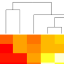

**[RNotes](../../index.html)**  

*****

Various R Programming Tools for Plotting Data

## Expanded Help Pages

|                                                | Help                                | Comments  |
|------------------------------------------------|-------------------------------------|-----------|
|              | [heatmap.2](heatmap2.html)          | Heatmaps  |

*****

*efg*  
`r format(Sys.time(), "%Y-%m-%d  %H%M")`                  