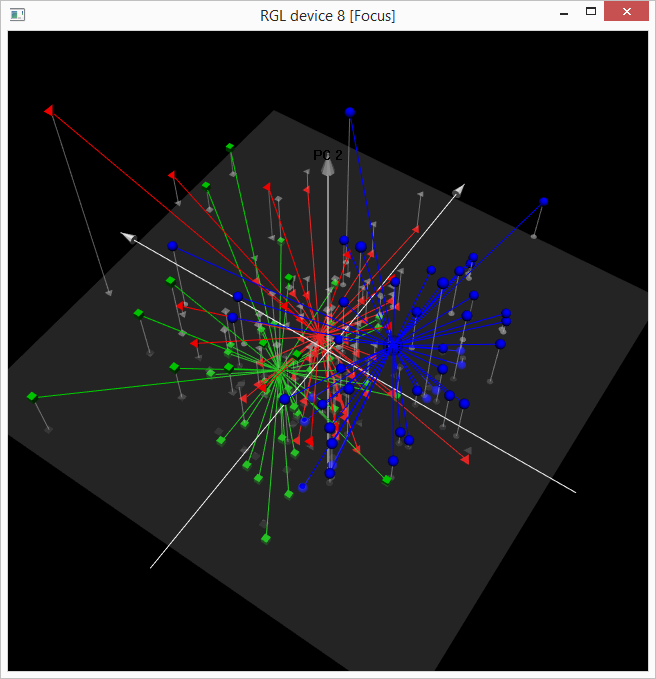

**[RNotes](../../index.html)**

*****

# Three dimensional PCA plots

This package provides an interactive 3D represenation of Principal Component Analysis (PCA) models using the 3D OpenGL package [*rgl*](http://cran.r-project.org/web/packages/rgl/rgl.pdf).

See [RGL: A R-library for 3D visualization with OpenGL](http://rgl.neoscientists.org/arc/doc/RGL_INTERFACE03.pdf) for a background on *rgl*'s capabilities. 

The first example here is from the online help for the [*pca3d* package](http://cran.r-project.org/web/packages/pca3d/pca3d.pdf).  I hope to add additional examples later.

```{r}
library(rgl)
library(pca3d)
```      
                              
## pca3d example

### metabo data

PCA analysis of *metabo* data -- relative abundances of metabolites from serum samples of three groups of individuals. See related article via [PubMed](http://www.ncbi.nlm.nih.gov/pmc/articles/PMC3402490/).

```{r}
data(metabo)
dim(metabo)
```

The *metabo* dataset is a data.frame with `r nrow(metabo)` rows and `r ncol(metabo)` columns.

Column 1 is the *group*, which is a factor with these possible values:

```{r}
table(metabo[,1])
```

The remaining columns are named X1, X2, ..., X428, with a few columns missing, such as X131.

### PCA analysis

Include all rows, but exclude *group* column by specifying -1 for the column.

```{r}
pca <- prcomp( metabo[,-1], scale.=TRUE )
```

### 2D

Specify the column 1 group for the 2D graphic:

```{r}
pca2d( pca, group= metabo[,1] )

```

The 2D plot is static and is not interactive.

### 3D
```{r}
pca3d( pca, group= metabo[,1] )
```
 
The "creating new device" message tells us that there is an interactive rgl graphic displayed on our console.  Screen captures are shown below of representative 3D graphics.


On a PC use shift and mouse roller button to zoom in or out.  Click and drag at different positions for rotations.  See ?par3d for 3D graphical info. 

The same figure above can be viewed from any position:


A bit more fancy:  black blackground, white axes, centroids, group labels:

```{r}
pca3d( pca, group= metabo[,1], 
    fancy= TRUE, bg= "black", 
    show.group.labels=TRUE,
    axes.color= "white", new= TRUE )
```
 


## Another Example

[Kaggle plankton classification training data](https://www.kaggle.com/c/datasciencebowl) can be represented with a matrix of ~3000 image features by 30,336 images.  Some of the 121 classes of plankton can be "seen" in a 3D PCA visualization.  See details on [this page](http://earlglynn.github.io/kaggle-plankton/).


 
*****

```{r}
packageVersion("pca3d")
packageVersion("rgl")
```

*efg*

`r format(Sys.time(), "%Y-%m-%d  %H%M")`                        