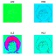
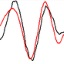

**[RNotes](../../index.html)**

*****

## Topics

|                                                               | Topic                                     |
|---------------------------------------------------------------|-------------------------------------------|
|   | [denoise image: denoise.dwt.2d, denoise.modwt.2d](denoise-image.html)   |
|           | [dwt.2d](dwt-2d.html)                     |
|         | [modwt.2d](modwt-2d.html)                 |
|               | [wavelet.filter](wavelet-filter.html)     |

*****

*efg*
`r format(Sys.time(), "%Y-%m-%d  %H%M")`                                                                                                         