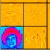

**[RNotes](../../index.html)**

*****

## Topics

|                                                               | Topic                                     |
|---------------------------------------------------------------|-------------------------------------------|
|   | [dwt.2d](dwt-2d.html)                     |
|   | [modwt.2d](modwt-2d.html)                     |

*****

*efg*
`r format(Sys.time(), "%Y-%m-%d  %H%M")`                                                                                                         